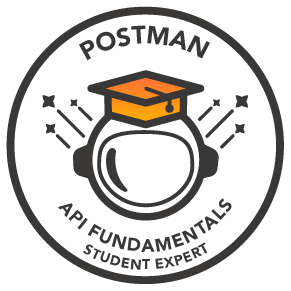
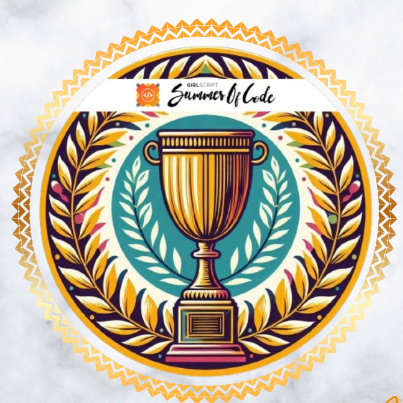
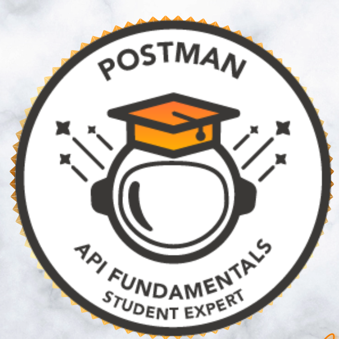
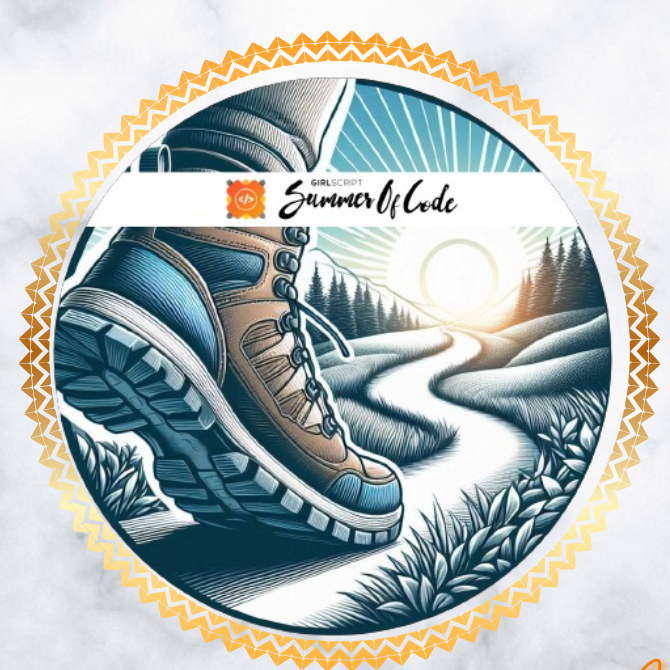

<div align="center">


<a href="https://git.io/typing-svg">
  
</a>

<br/>


<br/>


</div>

---

## 🧠 Who I Am

```typescript
const rohitSingh = {
  title: "Full Stack Developer | Graduate CS Student 2026",
  stack: {
    languages: ["Java", "JavaScript", "TypeScript"],
    frontend: ["React.js", "Next.js", "HTML", "CSS", "Redux"],
    backend: ["Node.js", "Express.js", "WebSocket"],
    databases: ["MongoDB", "PostgreSQL", "Redis"],
    cloud_devops: ["AWS", "Linux", "Docker"],
    tools: ["Git", "GitHub"],
  },
  launchedProjects: [
    "DRDO_AMC_MONITORING_PORTAL",
    "AI-Assisted Technical Document Intelligence & Decision Support System (in progress)",
  ],
  certifications: [], // to be added
  status: "Actively building & shipping full-stack + DevOps projects",
  openTo: ["Full-time roles", "Full Stack Developer positions", "Collaborations"],
};
```

---

## 🏅 Achievements

<details>	
 <summary><b>GSSOC(24) Badges 🪶</b></summary><br>
<div style='display:flex; align-items:center; gap: 10px; flex-wrap: wrap;' align='center'><a href="https://gssoc.girlscript.tech/leaderboard">

  
  
  
  
  
</a>
</div>
</details>

---

## 🚀 Featured Projects

### 📌 AMC Monitoring Portal

<div align="center">
  <a href="https://github.com/RohitSingh403/DRDO_AMC_MONITORING_PORTAL">
    
  </a>
</div>

| Layer | Technology |
|---|---|
| Frontend | React.js |
| Backend | Node.js, Express.js |
| Database | MongoDB / PostgreSQL |
| Other | REST APIs |

<div align="center">

[](https://github.com/RohitSingh403/DRDO_AMC_MONITORING_PORTAL)

</div>

---

### 📌 AI-Assisted Technical Document Intelligence & Decision Support System

> 🚧 **Coming Soon** — this project is currently being pushed to GitHub. Pin card and links will be added once the repo is live.

| Layer | Technology |
|---|---|
| Languages | TypeScript / Java |
| AI/DB | AI-assisted document processing |
| Infra | AWS, Docker |

---

## 🛠️ Tech Stack

**Languages**


**Frontend**


**Backend / Infra**


**Cloud**


**AI / Databases**


**Dev Tools**


---

## 📊 GitHub Stats

<div align="center">


</div>

---

## 📈 Contribution Graph

<div align="center">


</div>

---

## 🔗 Connect with Me

<div align="center">

[](https://www.linkedin.com/in/rohit-singh4/)
[](https://x.com/RohitSingh403)
[](mailto:itsmerohitsingh007@gmail.com)
[](https://iamrohitsingh.com/)

</div>


